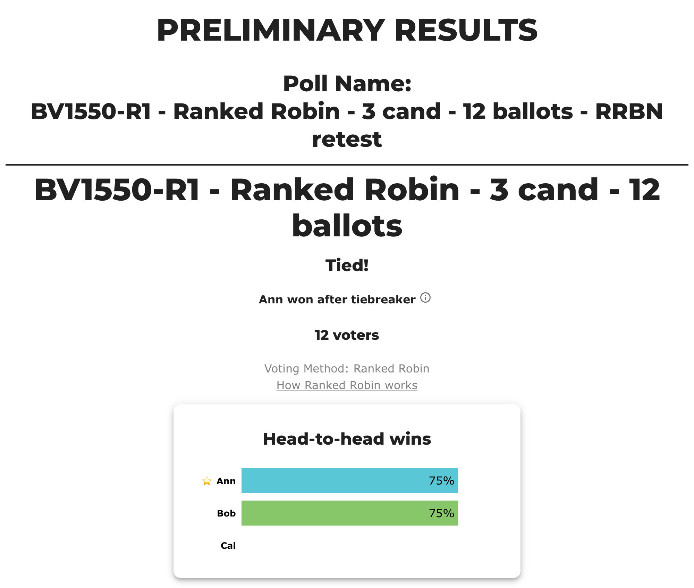
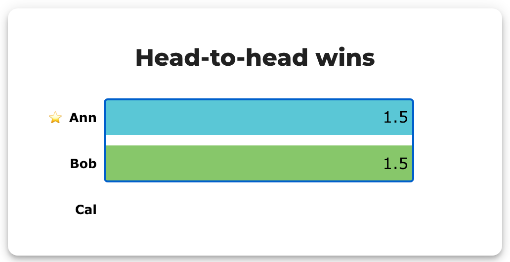
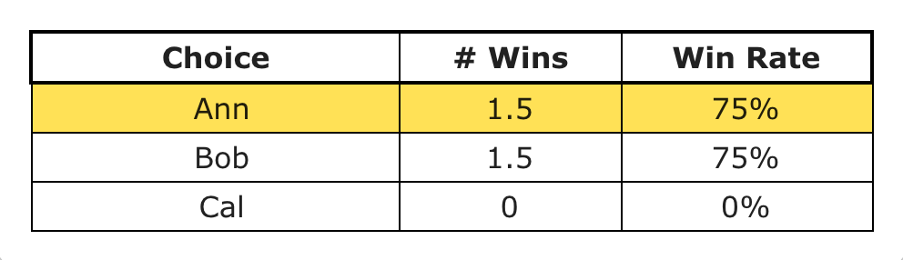
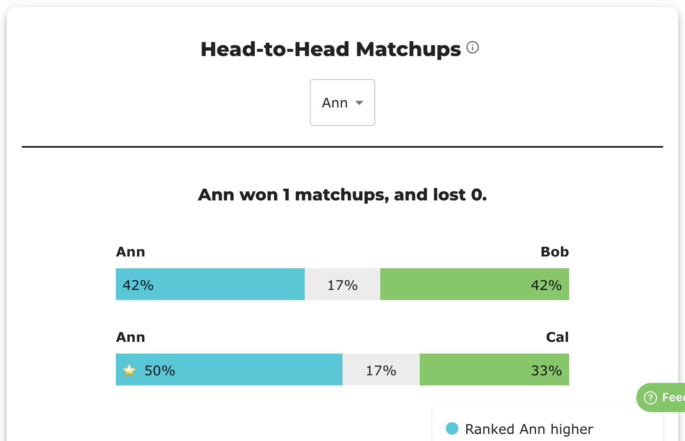

# Ranked Robin results pages, explained (why 12 ballots can show "1 win")

Source: BetterVoting's Ranked Robin results screen — the screenshots from
[bettervoting#885](https://github.com/Equal-Vote/bettervoting/issues/885) (election
[tcvc7r](https://bettervoting.com/tcvc7r/results)) and
[bettervoting#886](https://github.com/Equal-Vote/bettervoting/issues/886) (election
[p6vr9k](https://bettervoting.com/p6vr9k/results), test case BV1550, 3 candidates, 12 ballots).
*(Where the method itself came from — the 2021 "Ranked Advantage Voting" thread, its first VSE
numbers, and errata in its showcase examples: [ranked-robin-origins.md](ranked-robin-origins.md).)*

## The short answer

Yes — **1 win, 1 win, 0 wins is correct**, and so is "12 voters." The page mixes two different
units, and that's the whole confusion:

| Number on screen | What it counts | Unit |
|---|---|---|
| "12 voters" | Ballots cast | **people** |
| "# Wins" (the 1 / 1 / 0 bars) | Head-to-head **matchups won** | **matchups** |
| Matchup bars (42% / 17% / 42%) | How the 12 voters split inside one matchup | **people** |
| "Win Rate" (50%) | Wins ÷ possible matchups (n − 1) | **matchups** |

Think of a **round-robin sports tournament** with 3 teams. Each pair plays one game, so each team
plays 2 games. The 12 voters are the judges who decide every game. The standings show **games won
(0–2)**, never the number of judges. Expecting "6 wins" is expecting the standings to show points
scored instead of games won.

With *n* candidates each candidate has *n − 1* matchups, so the most wins anyone can show here is
**2**, no matter whether 12 or 12,000 people voted. This score is the **Copeland score** — the
field in the tabulator is literally named `copelandScore`.

## Worked example: BV1550 (Ann, Bob, Cal — 12 ballots)

The actual ballots from the CSV attached to #886 (rank 1 = favorite; blank = unranked, which
counts below every ranked candidate; two blanks on the same ballot = no preference between them):

| # | Ann | Bob | Cal |
|---|-----|-----|-----|
| 1 | 1 | 2 | – |
| 2 | 1 | 2 | – |
| 3 | – | 2 | 1 |
| 4 | – | 1 | 1 |
| 5 | 1 | 2 | – |
| 6 | 1 | 2 | – |
| 7 | 1 | 2 | – |
| 8 | – | 2 | 1 |
| 9 | 2 | 1 | – |
| 10 | 1 | 1 | 1 |
| 11 | – | 1 | – |
| 12 | – | – | 1 |

Score every pairing across all 12 ballots ("game 1", "game 2", "game 3"):

| Matchup | For left | Equal | For right | Result |
|---|---|---|---|---|
| **Ann vs Bob** | 5 (ballots 1,2,5,6,7) | 2 (ballots 10,12) | 5 (ballots 3,4,8,9,11) | **5–5 draw** |
| **Ann vs Cal** | 6 (1,2,5,6,7,9) | 2 (10,11) | 4 (3,4,8,12) | **Ann wins** |
| **Bob vs Cal** | 7 (1,2,5,6,7,9,11) | 2 (4,10) | 3 (3,8,12) | **Bob wins** |

These are exactly the bars in the screenshots: Ann–Bob 42% / 17% / 42% is 5/12, 2/12, 5/12; Ann–Cal
50% / 17% / 33% is 6/12, 2/12, 4/12. Every matchup row sums to 12 voters — the "12" and the "1"
coexist because they measure different things.

Final standings (the "# Wins" chart):

| Candidate | Matchups won | Win Rate (of n − 1 = 2) |
|---|---|---|
| Ann (A) | 1 (beat Cal; drew Bob) | 50% |
| Bob (B) | 1 (beat Cal; drew Ann) | 50% |
| Cal (C) | 0 | 0% |

A drawn matchup gives **neither** candidate a win — that's why 1 + 1 + 0 = 2 wins total instead of
3. *(That was the April 2025 behavior in the screenshots. Since the tiebreaker overhaul merged
2026-05-12, BetterVoting's Copeland score awards **½ for a drawn matchup**, so the same election
today shows Ann 1.5 / Bob 1.5 / Cal 0 — displayed as 75% / 75% / 0%.)*

## So who won — and why it looked "unstable"

Ann and Bob tie at 1 win each. The tabulator
([RankedRobin.ts](https://github.com/Equal-Vote/bettervoting/blob/main/packages/backend/src/Tabulators/RankedRobin.ts))
breaks ties in this order:

1. **Most matchup wins** (Copeland score) — Ann and Bob tied, so continue.
2. **If exactly two are tied: their own head-to-head** ("preferred over X in runoff") — but
   Ann–Bob was itself a 5–5 draw, so continue. *(This rung is BetterVoting's, not the official
   spec's — see [Deployed ladder vs. official spec](#deployed-ladder-vs-official-spec) below.)*
3. **Random pick.** The code logs: *"picked in random tie-breaker, more robust tiebreaker not yet
   implemented"* and sets `tieBreakType: 'random'`.

That third rung is why identical ballots produced different winners on different runs (the
"unstable tie breaking" I reported in #885), and why in April 2025 the header cheerfully said
"A wins!" — or even starred a different candidate than the header named — without disclosing that
a coin flip decided it.

**Fixed as of mid-2026.** The tiebreaker overhaul (branch `JacksonLoper/tiebreaker`: "Expose
tiebreaker information to the frontend", "Apply tiebreaker logic to all methods"; merged
2026-05-12) reworked the results page. Verified 2026-08-01 on the live
[p6vr9k](https://bettervoting.com/p6vr9k/results) election and on fresh sandbox runs of the same
12 ballots: the page now says **"Tied!"**, then **"Bob won after tiebreaker"** with an ⓘ tooltip —
*"Random ties are broken from highest to lowest priority in the order Bob, Ann, and Cal. This
order was determined from shuffling the original candidate list"* — and the chart stars the same
candidate the header names. The winner is stable across repeated fetches (the shuffle is stored
per election), and the results API exposes `tied: [Bob, Ann]` and `tieBreakType: "random"`.
Screenshots of the new display are in the [live retest section](#live-retest-2026-08-01-election-bv1550-r1) below.

### Deployed ladder vs. official spec

**(Found 2026-08-01, sandbox; filed as [#1469](https://github.com/Equal-Vote/bettervoting/issues/1469).)**
Rung 2 above is BetterVoting's invention, and rung 3 arrives too early. The official spec
([electowiki, "Degrees of ties"](https://electowiki.org/wiki/Ranked_Robin#Degrees_of_ties)) says
*all* candidates tied on matchup wins become finalists, and the finalist with the greatest **sum
of pairwise win margins over the other finalists** is elected — the 1st Degree, the method's
founding "Copeland+Margins" idea ([origins](ranked-robin-origins.md)). For exactly two finalists
that reduces to their head-to-head, so rung 2 silently matches the spec; but for **3+ tied
finalists `RankedRobin.ts` has no branch at all** — the margin sums are never computed and the
tie drops straight to the random rung.

Sandbox proof: Ranked Robin, candidates `Dre,Edith,Frank`, votes `2:1,2,3` / `4:3,1,2` /
`5:2,3,1` — 11 ballots forming a cycle (Dre>Edith 7–4, Edith>Frank 6–5, Frank>Dre 9–2), all tied
at 1 win. The spec elects **Frank** deterministically (margin sums: Frank +6 = +54.5% points,
Edith −2, Dre −4). The sandbox said "Tied! **Dre** won after tiebreaker" with the random-shuffle
tooltip; re-listing the candidates as `Edith,Frank,Dre` (same ballots, columns permuted) switched
the winner to **Edith**. In the sandbox the "random" rung is literally first-listed-wins —
`sandboxController.ts` sets `tieBreakOrder` to input order and never calls
`shuffleCandidatesForRandomTiebreak` (hosted elections do get the per-election seeded shuffle,
which is why p6vr9k and mj26yj are stable-but-different).

Bonus irony: the official ladder would also have settled *this page's* election
deterministically. Ann–Bob exit the 1st Degree still tied (two finalists, 5–5 draw → both margin
sums 0), but the 2nd Degree — margins over *all* candidates — gives Ann +2 vs **Bob +4**: the
same Bob that Borda picks in the cross-check below, for the same margin-awareness reason.
Neither degree is implemented, so both random-winner elections (p6vr9k → Bob, mj26yj → Ann) were
coin flips the spec would have decided.

## Live retest, 2026-08-01 (election BV1550-R1)

To confirm end-to-end (not just on the old election), I created a fresh hosted election through
BetterVoting's public API — as an anonymous guest (`temp_id` cookie), the JSON-payload equivalent
of sending BV a YAML — and cast the same 12 ballots with rotating voter identities:

- Election: **BV1550-R1 - Ranked Robin - 3 cand - 12 ballots - RRBN retest** →
  [bettervoting.com/mj26yj/results](https://bettervoting.com/mj26yj/results) (still open for voting,
  so treat the link as a live sandbox; the screenshots below are the 12-ballot state)
- API check: `elected: [Ann]`, `tied: [Ann, Bob]`, `tieBreakType: "random"`,
  `copelandScore: Ann 1.5, Bob 1.5, Cal 0`

**The header now discloses the tie** — "Tied!", then the winner labeled as a tiebreak result, and
the chart stars the same candidate the header names:



**The ⓘ tooltip explains the tiebreaker** — and note it names *this* election's shuffled order
(Ann, Bob, Cal), while p6vr9k's tooltip says (Bob, Ann, Cal): each election stores its own shuffle,
which is why the winner is stable per election but differs between elections with identical ballots:


**Ties now score ½ win.** Clicking the chart toggles percent ↔ count: Ann and Bob show **1.5**
matchup wins (1 win over Cal + ½ for their 5–5 draw), not the 1 from the 2025 screenshots:



**The Race Details table** shows the same — # Wins 1.5 / Win Rate 75% (1.5 of 2 possible), with the
winner's row highlighted:



**The matchup data is unchanged from 2025** — Ann–Bob 42% / 17% / 42% (5–5 with 2 equal) and
Ann–Cal 50% / 17% / 33% (6–4 with 2 equal), matching the hand counts earlier in this page:



**Residual bug (found 2026-08-01, sandbox; filed as
[#1468](https://github.com/Equal-Vote/bettervoting/issues/1468)):** when a Copeland tie is broken by rung 2 (the tied
pair's own head-to-head) instead of rung 3, the header names the runoff winner but the chart still
sorts by `tieBreakOrder` and stars row 0 — so header and star can disagree. Repro in the
[sandbox](https://bettervoting.com/sandbox): Ranked Robin, candidates `A,B,C,D,E`, votes
`10:2,1,3,4,5` / `10:5,4,3,1,2` / `3,2,5,4,1` → B and E tie at 3 wins, E beats B 11–10
head-to-head, header says "E wins!" but the chart stars B. Cause: `RankedRobin.ts` passes no
`evaluate` callback to `runBlocTabulator` (STAR passes one that hoists the elected candidate to
row 0), so `summaryData.candidates` stays sorted by (copelandScore, tieBreakOrder) and
`ResultsBarChart stars={1}` stars the wrong row.

Upstream issue status:

- [#885](https://github.com/Equal-Vote/bettervoting/issues/885) — closed 2026-08-01 as not-planned (the numbers were correct; this page is the explanation I wished the UI had)
- [#886](https://github.com/Equal-Vote/bettervoting/issues/886) — who won, Bob or Ann? Was the tie disclosed? **Closed 2026-08-01 as completed** after verifying the fix above
- [#1063](https://github.com/Equal-Vote/bettervoting/issues/1063) — open; deterministic tie-breaking using candidate lot numbers (the random rung is still random — `RankedRobin.ts` still says "more robust tiebreaker not yet implemented")
- [#1432](https://github.com/Equal-Vote/bettervoting/issues/1432) — open; surface tie-break explanations in exports too
- [#1469](https://github.com/Equal-Vote/bettervoting/issues/1469) — open (filed 2026-08-01); 3+-way Copeland ties skip the official 1st-Degree margins tiebreaker entirely — see [Deployed ladder vs. official spec](#deployed-ladder-vs-official-spec)
- [#1168](https://github.com/Equal-Vote/bettervoting/issues/1168) — open; document that Ranked Robin uses Copeland tie-breaking

## Cross-check: LeGrand's calculator (run 2026-08-01)

Ran the same 12 ballots through [LeGrand's ranked-ballot calculator](https://www.cs.angelo.edu/~rlegrand/rbvote/calc.html)
(background: [legrand-ranked-ballot-methods.md](legrand-ranked-ballot-methods.md)). Translated to his
notation — unranked candidates fall below every ranked one and tie each other:

```
5:Ann>Bob>Cal      # ballots 1,2,5,6,7
2:Cal>Bob>Ann      # ballots 3,8
1:Bob=Cal>Ann      # ballot 4
1:Bob>Ann>Cal      # ballot 9
1:Ann=Bob=Cal      # ballot 10
1:Bob>Ann=Cal      # ballot 11
1:Cal>Ann=Bob      # ballot 12
```

His pairwise matrix — tied preferences count as **half a vote each way**, so the 5–5 draw with 2 equals
above appears here as 6–6:

| for \ against | Ann | Bob | Cal |
|---|---|---|---|
| **Ann** | — | 6 | **7** |
| **Bob** | 6 | — | **8** |
| **Cal** | 5 | 4 | — |

The verdict line: **"There is no Condorcet winner. The Smith set is {Ann, Bob}."** The tie is structural,
not a BetterVoting bug.

| Winner | Methods |
|---|---|
| **Bob**, outright | Black, Borda |
| tie → random-ballot tiebreaker | Baldwin, Copeland, Dodgson, Nanson, Raynaud, Schulze, Simpson, Small, Tideman |

Nine of the eleven methods that ran fall through to the tiebreaker. Supplying `Ann>Bob>Cal` as the
tiebreaking ranking elects Ann in all nine; supplying `Bob>Ann>Cal` elects Bob in all nine. So this
election defeats essentially every Condorcet completion rule, not just Ranked Robin's — which is the
strongest possible defense of BetterVoting here: there is no "better tabulator" that would have found a
winner on the ballots.

With one exception. Borda decides it outright (and Black only because it falls back to Borda when no
Condorcet winner exists):

| | Ann | Bob | Cal |
|---|---|---|---|
| Borda score | 2 | **4** | −6 |

The reason is exactly Copeland's blind spot. Ann and Bob are perfectly tied head-to-head, so the only
remaining evidence is *how decisively* each handles Cal — **Bob beats Cal 8–4, Ann only 7–5**. Copeland
counts wins and cannot see margins, so it ties; Borda counts margins and doesn't.

That reframes the instability documented above. The two BetterVoting elections built from these same 12
ballots disagree — p6vr9k's shuffle elects **Bob**, mj26yj's elects **Ann** — while Borda picks **Bob**
from the ballots alone, every time. The disagreement isn't noise around a genuinely unknowable answer;
it's a margin-blind score discarding the one piece of evidence that separates the two candidates. Good
argument for [#1063](https://github.com/Equal-Vote/bettervoting/issues/1063): a margin-aware rung (Borda,
or Copeland//Borda) before the random one would settle this election deterministically, and would have
made both elections agree.

### IRV can't count this election at all

Hare (IRV), Bucklin, Carey and Coombs each refuse the ballots outright:

> Hare elections require fully-ranked ballots with no tied preferences. Please correct the ranked ballots
> and try again or try another method.

Four of the 12 ballots carry equal ranks (`Bob=Cal>Ann`, `Ann=Bob=Cal`, and the two truncated ballots,
whose unranked candidates tie at the bottom), and every first-preference-counting method in the
calculator rejects the whole set rather than guess a convention. Whatever Ranked Robin's results page
gets wrong presentationally, it *accepts* ballots that IRV's counting rule has no defined answer for.

## Common misreadings (the traps I fell into)

- **"I expected 6 wins and 6 wins."** 6 is the number of *ballots* preferring Ann in her winning
  matchup (Ann > Cal on 6 of 12). "# Wins" counts *matchups*, so the ceiling is n − 1 = 2, not 12.
- **"Is it 12 voters or 2 voters?"** The wins chart sums to 2 (1 + 1 + 0), which looks like a tiny
  electorate. That 2 is *decided matchups*, not people; the 12 voters sit inside each matchup bar.
- **A 50% bar doesn't mean half the voters.** It means half the *possible matchups* (1 of 2).
