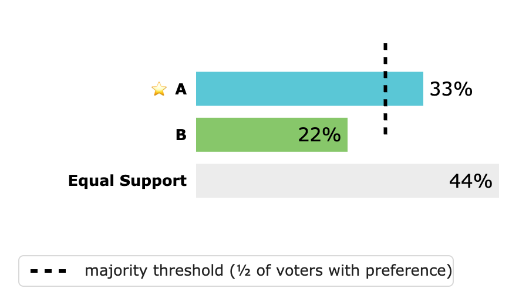
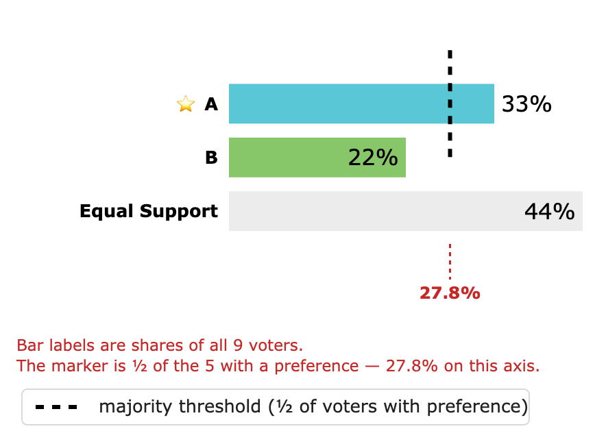
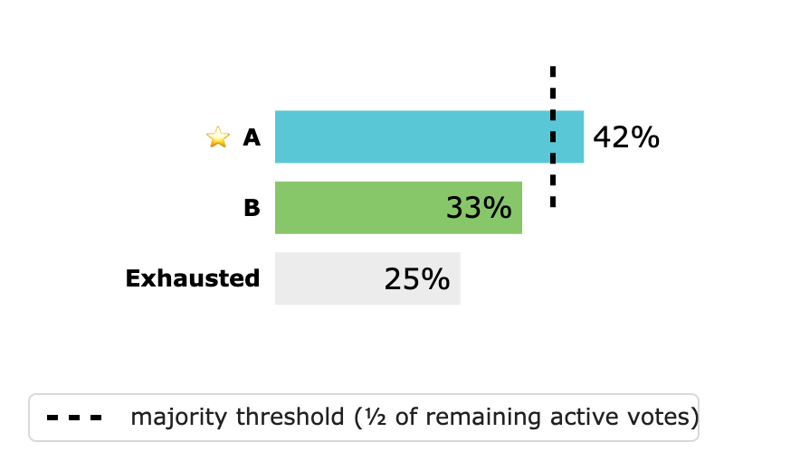
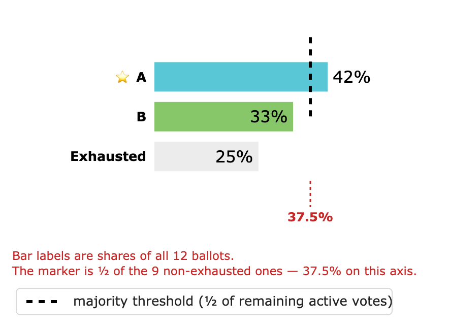
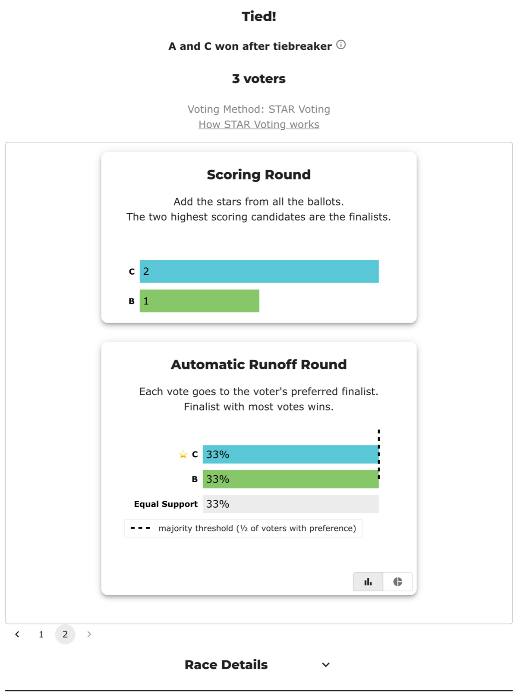

# One axis, two denominators (why a 33% bar sits past the "majority threshold")

Source: BetterVoting's runoff charts, filed as
[bettervoting#1471](https://github.com/Equal-Vote/bettervoting/issues/1471). Live repros, both created
2026-08-03 and still open:
[**2dm864**](https://bettervoting.com/2dm864/results) (STAR, 3 candidates, 9 ballots) and
[**hx848r**](https://bettervoting.com/hx848r/results) (IRV, 3 candidates, 12 ballots). The component is
[`ResultsBarChart.tsx`](https://github.com/Equal-Vote/bettervoting/blob/main/packages/frontend/src/components/Election/Results/components/ResultsBarChart.tsx).
*(Which BetterVoting issues these notes back with recomputation:
[bettervoting-issues.md](bettervoting-issues.md).)*

## The short answer

Every number on the chart is right. The chart is still wrong, because two of those numbers are
**fractions of different wholes** and are drawn against the same horizontal axis with nothing saying so.

The bar labels are shares of *everyone who voted*. The dashed "majority threshold" is half of *the
voters who expressed a preference between the two finalists* — a smaller group. Put a percentage
measured on the big denominator next to a line placed on the small one, and the winner's bar crosses a
"majority" line while its own label reads 33%.

This is not a tabulation bug and not a wording bug. Both quantities are computed correctly and the
legend describes the line accurately. It is a **unit** bug, of the same family as the one in
[ranked-robin-results-explained](ranked-robin-results-explained.md), where a page showed matchups and
people on one screen: the reader is asked to compare two things that are not comparable, and given no
cue that they differ.

## STAR: nine voters, four of them indifferent

Nine ballots. Three prefer A to B, two prefer B to A, four rate the two finalists **equally** — a
score of 4 for both, so the ballot is counted, it simply does not break the tie between them. STAR
calls that category **Equal Support**; it is the scored-ballot cousin of an
**exhausted ballot**, in that the ballot exists but cannot help either finalist.

| Runoff row | Votes | Labelled |
|---|---|---|
| A | 3 | **33%** |
| B | 2 | 22% |
| Equal Support | 4 | 44% |

Labels divide by **9**, every ballot cast. The marker divides by **5**, the ballots with a preference,
and lands at 2½ votes:



2½ out of 9 is **27.8%** of the axis the labels are measured on. So the reader sees a majority
threshold at 27.8%, a winner at 33%, and the longest bar on the chart — 44%, Equal Support — belonging
to no candidate at all:



## IRV: twelve ballots, three of them exhausted

The same component draws the IRV final round, and it fails the same way. Five ballots rank A first,
four rank B first, three bullet-vote for C. C is eliminated; those three ballots have no further
ranking and **exhaust**.

| Final round | Votes | Labelled |
|---|---|---|
| A | 5 | **42%** |
| B | 4 | 33% |
| Exhausted | 3 | 25% |

Labels divide by **12**; the marker is half of the 9 still active, i.e. 4½ votes = **37.5%** of the
same axis.





Worth noticing that the IRV legend is the better-written of the two — "½ of remaining active votes"
actually names its denominator, where STAR's "½ of voters with preference" leaves the reader to guess
whether "preference" means *ranked anyone at all* or *strictly preferred one finalist to the other*.
It is the latter. Neither wording rescues the picture, because the labels never state theirs.

## Bloc STAR: the same chart once per seat, and a tie sitting on the line

`STARResultSummaryWidget` takes a `roundIndex` and renders one card per seat, so a Bloc race draws this
chart N times. [`fk38pk`](https://bettervoting.com/fk38pk/results) — an old QA election, 3 candidates,
2 seats, 3 ballots — happens to hold the best and worst cases of the whole issue in one election, one
click apart.

**Seat 1** is the control. A wins the runoff 3–0 and nobody rates the two finalists equally, so the
label denominator (`3 + 0 + 0`) and the marker denominator (`(3 + 0)/2`) are the same three voters: the
bar reads 100%, the line sits at 50% of that axis, and the picture is honest.


**Seat 2** is the degenerate case. With A elected and removed, C and B each hold one preference and one
voter rates them equally — bars `1 / 1 / 1`.

| Seat 2 runoff | Votes | Labelled |
|---|---|---|
| C | 1 | **33%** |
| B | 1 | **33%** |
| Equal Support | 1 | 33% |

Labels divide by **3**; the marker is half of the 2 decided voters = **1 vote**, which is exactly the
height of *both* candidate bars. So two bars touch a line labelled "majority threshold" in a runoff
**neither of them won** — the seat went to the score rung, and the page's own headline says so ("Tied!
A and C won after tiebreaker").



Two things follow that the single-winner figures above don't show:

- **A Bloc race repeats the defect per seat, and later seats are where it should bite hardest.** Each
  elected candidate is removed, so the pairs left for later seats are the ones voters were least
  decided between — exactly when the Equal Support bar, and therefore the gap, is largest.
- **`m = sum / 2` is half, not a majority.** At an even number of decided voters, a bar that *reaches*
  the line has exactly ½ — tied, not winning. Fixing only the denominator would leave this seat drawn
  as 50% / 50% with both bars ending on "majority threshold"; the marker wants
  `Math.floor(sum/2) + 1` (whole votes) or a line drawn just past ½ at the same time.

## Where the honest 50% line would be

The sharpest way to see the size of the gap: ask where a line at *half of all voters* would fall.

In the STAR case that is 4½ of 9 voters. The axis runs to 4 votes — the Equal Support bar is the
longest thing on it — so **a true majority of all voters is off the right edge of the chart entirely**.
It cannot be drawn. That is the real content of the picture: with four of nine voters indifferent, no
finalist can reach half of the electorate, and the chart has no way to show that fact, so it shows a
different, reachable line instead and labels it "majority".

The gap scales with the last bar. With one indifferent voter out of nine, marker and labels sit within
a couple of points of each other and nobody notices. With four, the marker is 22 points adrift.

## The two lines of code

```ts
// labels — sum of ALL bars                            (ResultsBarChart.tsx:52)
percentDenominator ??= data.reduce((sum, d) => sum + d[xKey], 0);

// marker — sum EXCLUDING the last bar                 (ResultsBarChart.tsx:83-88)
const sum = data.reduce((prev, d, i) => {
  if (i == data.length-1) return prev;  // don't include exhausted or equal support votes
  return prev + d[xKey];
}, 0);
const m = sum / 2;
```

Each is defensible alone. The labels answer "how did the electorate split?", the marker answers "what
did the winner have to beat?" — both are real questions. The defect is putting the answers on one axis.

A detail that explains the drawing: `s[majorityLegend] = i < 2 ? m : null` (line 91) sets the marker
value on only the first two rows, so the dashed line stops after the second bar rather than spanning
the plot. In both figures above it ends below B and never reaches the Equal Support / Exhausted row —
which quietly implies the line does not apply to that row, while the bar still visibly runs past it.

## The general lesson

**One axis, one denominator.** A shared axis is a claim of comparability; a reader is entitled to
assume that two marks the same distance along it mean the same amount of the same thing. Once a chart
mixes two wholes it can be perfectly accurate number-by-number and still say something false as a
picture.

The three ways out, in the order they cost:

1. **Relabel** — divide the labels by the marker's denominator too. The winner then reads 60% with the
   marker at 50%, which is exactly what "½ of voters with preference" promises. Cost: Equal Support
   becomes 80% of a group it is not a member of, so that row needs separate treatment.
2. **Re-legend** — keep labels as shares of all voters and put the marker's basis inline: "majority of
   the 5 voters with a preference". Cheapest, and honest, but still asks the reader to hold two
   denominators at once.
3. **Show both** — the winner's share of voters-with-a-preference *and* of all voters. Most
   informative, most cluttered.

There is a fourth, which the STAR case argues for on its own: when the excluded group is large enough
that no candidate can reach half of all voters, **say so** rather than drawing a threshold that is
reachable only because the hard voters were removed from the denominator.

## Reproducing it

Sandbox (no election needed) — [bettervoting.com](https://bettervoting.com), STAR, candidates `A,B,C`:

```
3:5,0,1
2:0,5,1
4:4,4,0
```

Scoring round: A 31, B 26, C 5, so A and B are the finalists. Runoff: A 3, B 2, Equal Support 4.

For the IRV side, candidates `A,B,C` with rank-per-candidate ballots (`0` = unranked): five `1,2,0`,
four `2,1,0`, three `0,0,1`. Round 1 is A 5, B 4, C 3; C is eliminated and its three ballots exhaust.

Both live elections above are open, so the charts can be checked against the real results pages rather
than the sandbox.
